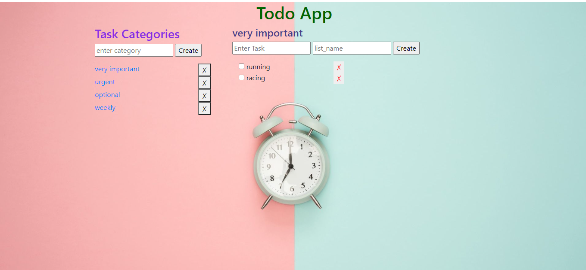

# TODO APP

## Project Overview
This is a todo web application in which user can plan and check their tasks. User can also divide their tasks into different categories according to their needs.
## Technology Stack
1. Bootstrap - It is used to make the appeareance and layout of web application good.
2. Flask - It is used to handle backend of our application.
3. SqlAlchemy ORM - It is used for database interaction in easy and efficient way.
4. PostgreSQL - postgres database is used to store data.
## Features
1. Divide tasks into categories . eg-urgent , important etc.
2. check whether the task is completed or not.
3. Navigate among different categories easily.